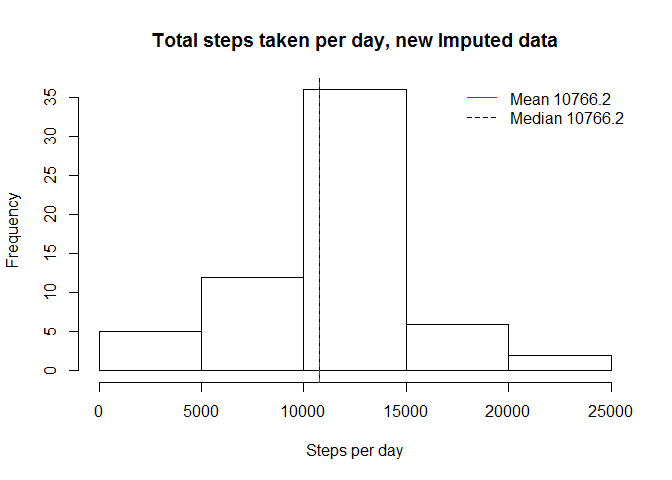

# Reproducible Research: Peer Assessment 1

Some basic settings:

```r
    # setting timelocale to English. Im in Finland so I do this just in case
    Sys.setlocale("LC_TIME", "English")
```

```
## [1] "English_United States.1252"
```

```r
    #load ggplot2 for qplot
    library(ggplot2)
```

## Loading and preprocessing the data

Loading data form file activity.csv, first we unzip file activity.zip, if needed  

- Loading data  
- File activity.zip is supposed to be found from working directory, if not please uplod it from:  
  https://d396qusza40orc.cloudfront.net/repdata%2Fdata%2Factivity.zip  
- Also I change txt date strig to Date type
  

```r
    if(!file.exists("activity.csv")) {
        unzip("activity.zip")
        }
    
    actdata <- read.csv("activity.csv", stringsAsFactors=FALSE)
    actdata$date <- as.Date(actdata$date, "%Y-%m-%d")
```

####Basic summary of activity data:

```r
    summary(actdata)
```

```
##      steps             date               interval     
##  Min.   :  0.00   Min.   :2012-10-01   Min.   :   0.0  
##  1st Qu.:  0.00   1st Qu.:2012-10-16   1st Qu.: 588.8  
##  Median :  0.00   Median :2012-10-31   Median :1177.5  
##  Mean   : 37.38   Mean   :2012-10-31   Mean   :1177.5  
##  3rd Qu.: 12.00   3rd Qu.:2012-11-15   3rd Qu.:1766.2  
##  Max.   :806.00   Max.   :2012-11-30   Max.   :2355.0  
##  NA's   :2304
```

```r
    totalcases <- nrow(actdata)
    ok <- sum(complete.cases(actdata))
    notok <- sum(!complete.cases(actdata))
```

- Number of total cases is: 17568 and number of cases with missing data is 2304.  
- Missing percentage is 13.1 %  

## What is mean total number of steps taken per day?

Calculation of mean values for steps taken per day, removing missing values

```r
    daysteps <- aggregate(actdata$steps, by=list(date=actdata$date), FUN=sum)
    colnames(daysteps) <- c("Date", "steps")
    avg <- mean(daysteps$steps, na.rm=TRUE)
    med <- median(daysteps$steps, na.rm=TRUE)
    total <- sum(daysteps$steps, na.rm=TRUE)
    #set names to daystep data
```

- Mean value of total number of steps taken per day is 10766.19  
- Median value ot total number of steps taken per day is 10765

####From histogram we get more detail information about distribution of steps/day


```r
    hist(daysteps$steps, 
        breaks=5,
        xlab="Steps taken per day", 
        main="Distribution of steps taken per day"
        )

        abline(v = med, col = "black", lwd = 1, lty=1)
        abline(v = avg, col = "red", lwd = 1, lty=2)
        
        legend(
            "topright", 
            bty="n",
            col=c("red", "black"),
            legend=c(paste("Mean", round(avg,1)), paste("Median", round(med,1))), 
            lty=c(2,1)
            )
```

 

## What is the average daily activity pattern?

```r
    intersteps <- aggregate(actdata$steps, 
                            by=list(actdata$interval), 
                            FUN=mean, 
                            na.rm=TRUE
                            )
    colnames(intersteps) <- c("interval", "steps")
    #Find row where is maximum value
    ismax <- intersteps$steps==max(intersteps$steps)
    #Extract maximum values
    maxinterval <- intersteps[ismax,"interval"]
    maxval <- intersteps[ismax,"steps"]
```

- Interval: 835 has maximum steps: 206.2 from all intervals.

- We can see this also from graph below code, where average steps are plotted against intervals


```r
    plot(intersteps$steps ~ intersteps$interval, 
        type="l",
        xlab="Interval", 
        ylab="Avg Steps",
        main="Average steps per intervals"
        )

        #lines for locate interval with maximum value
    abline(v = maxinterval, h=maxval, col = "red", lwd = 1, lty=2)

    legend("topright", 
            bty="n", 
            legend=paste("Interval:", maxinterval, "has max avg:", round(maxval,1)
                         )
            )
```

 

## Imputing missing values
  
- From total number of 17568 obrervations there are 2304 observation with missing values (coded 
as NA in the data), meaning that 13.1 % of observations is not completed . 
- To avoid bias to calculations I make some imputations/replacements for those missing values. 
- Imputation strategy here is replase missing values with dayily average steps value.


```r
    imputedata <- actdata
    #impute missing values with precalculted avg values, from step: What is the average daily activity pattern??
    imputedata$steps <- ifelse(!is.na(imputedata$steps), imputedata$steps, intersteps[,2])
```

####Summary of the imputed data


```r
    summary(imputedata)
```

```
##      steps             date               interval     
##  Min.   :  0.00   Min.   :2012-10-01   Min.   :   0.0  
##  1st Qu.:  0.00   1st Qu.:2012-10-16   1st Qu.: 588.8  
##  Median :  0.00   Median :2012-10-31   Median :1177.5  
##  Mean   : 37.38   Mean   :2012-10-31   Mean   :1177.5  
##  3rd Qu.: 27.00   3rd Qu.:2012-11-15   3rd Qu.:1766.2  
##  Max.   :806.00   Max.   :2012-11-30   Max.   :2355.0
```
  
  
I calculate: 

- mean,  
- median and
- total values  

of steps per day again to compare result with original and imputed data  
  

```r
    daystepsImp <- aggregate(imputedata$steps, by=list(imputedata$date), FUN=sum)
    colnames(daystepsImp) <- c("date", "steps")
    avgImp <- mean(daystepsImp$steps, na.rm=TRUE)
    medImp <- median(daystepsImp$steps, na.rm=TRUE)
    totalImp <- sum(daystepsImp$steps, na.rm=TRUE)
```
  
Histogram from data where missing values are replaced.
  

```r
    hist(daystepsImp$steps, 
        xlab="Steps per day", 
        main="Total steps taken per day, new Imputed data"
        )
    
    #put lines for mean and median values
    abline(v = medImp, col = "black", lwd = 1, lty=1)
    abline(v = avgImp, col = "red", lwd = 1, lty=2)

    legend("topright", 
        bty="n",
        col=c("red", "black"),
        legend=c(paste("Mean", round(avgImp,1)), 
                    paste("Median", round(medImp,1))
                 ), 
       lty=c(1,2)
       )
```

 

Effects of data imputation:  

* mean value are not changed from: 10766.19   to: 10766.19  
* median value are changed from: 10765   to: 10766.19  
* total number of steps is changed from: 570608  to: 656737.5  
* Imputation changend mostly days where steps was between 10000 and 15000. Reason was imputation plan where I used average step of individual day. If lot of missing values is on days where average steps are between 10000 and 15000 it's natural that those days will get lot of observations. Also that step range was dominant before imputation it´s natural that it included also biggest part of days. With another imputation method, results may differ.


## Are there differences in activity patterns between weekdays and weekends?

- Now I investigate differences with weekdays and weekends. First I have to find weekpart, based on weekdays.   
- After that I can make graphs to investigation. 


```r
    imputedata$weekpart <- ifelse(weekdays(imputedata$date) %in% c("Monday", "Tuesday", "Wednesday", "Thursday", "Friday"), 
                                "Weekday", 
                                "Weekend"
                                )

    ImputedataMean <- aggregate(imputedata$steps, 
                                by=list(imputedata$interval, imputedata$weekpart), 
                                FUN=mean
                                )
    colnames(ImputedataMean) <- c("interval", "weekpart", "steps")
```

On following graphs I investigate, that is there differece between weekdays and weekend days activity. 
I used Imputed data for this investigation.
  
- on x-axis there is 5-minute intervals   
- on y-axis is average number of steps on interval   


```r
    qplot(interval, steps,  
        geom="line", 
        data=ImputedataMean,
        facets = weekpart~.,  
        main="Average steps per interval",  
        xlab="Interval",  
        ylab="Average Steps"
        ) 
```

 

- Some variation can be noticed.  
- Anyway I put both to same plot to indentify that variation better.  
- Below looks like that on earlier (<1000) intrevals there is more steps on weekdays and after intervals 1000 there is more steps on weekend days. 


```r
#create vector to separate data for plot
    weekday <- ImputedataMean$weekpart=="Weekday"

    plot(ImputedataMean[weekday,"steps"] ~ ImputedataMean[weekday,"interval"], 
        type="l", col="black",
        main="Average steps on weekdays and weekend on same graph", 
        xlab="Interval", 
        ylab="Steps"
        )
    
    lines(ImputedataMean[!weekday,"steps"] ~ ImputedataMean[!weekday,"interval"], 
        type="l", col="red"
        ) 
    
    legend(
        "topright", 
        bty="n",
        col=c("black", "red"),
        legend=c("Weekday", "Weekend"), 
        lty=c(1,1)
        )
```

 


